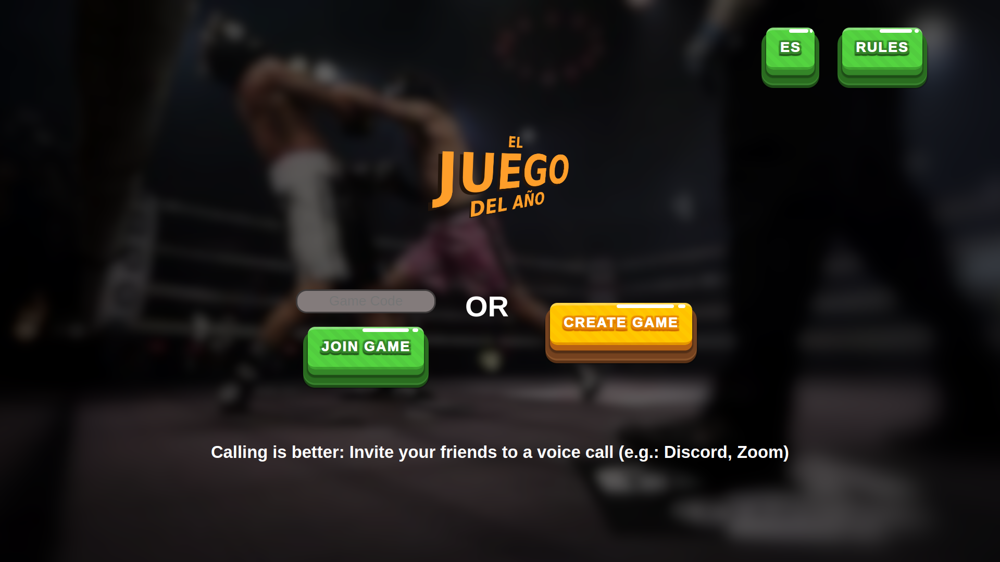
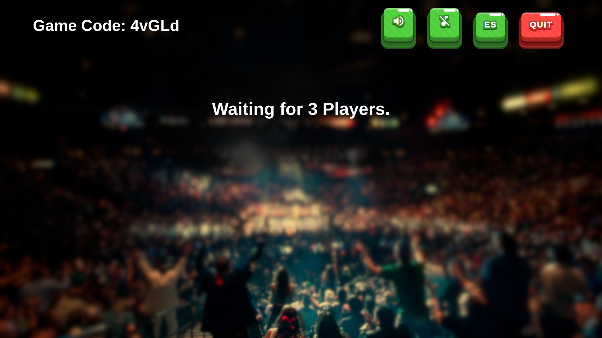
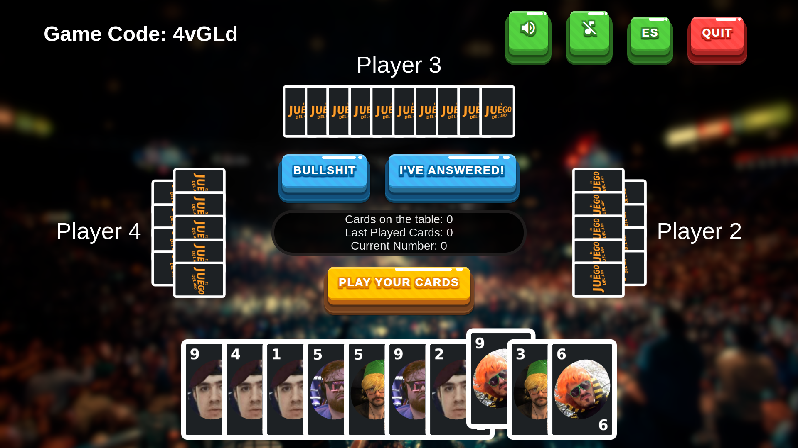

<h1>The Game Of The Year</h1>
<h2>Four player online card game made with Nodejs, Express, React and SocketIO</h2>
<h3>Game based on the "Cheat" card game with the style of "La velada del año" (spanish streamer event)<h3>

## Screenshots




## How to run the game locally (Node required)

## Installation
Go to the root of the project directory and open two terminals.

In the first one:
- Use npm to install the server-side dependencies

```bash
npm install
```

- And then use npm to run server

```bash
npm start
```

In the second one:
- Navigate into the client folder and use npm to install the client-side dependencies

```bash
cd client
npm install
```
- And finally, use npm to run client

```bash
npm start
```
The game was designed as an online game, but can be played locally with 4 players opening 4 tabs in the same room.
You can quickly do that by introducing a code in the "game code" field and clicking 4 times the "JOIN GAME" button while pressing "Ctrl".

Enjoy.
